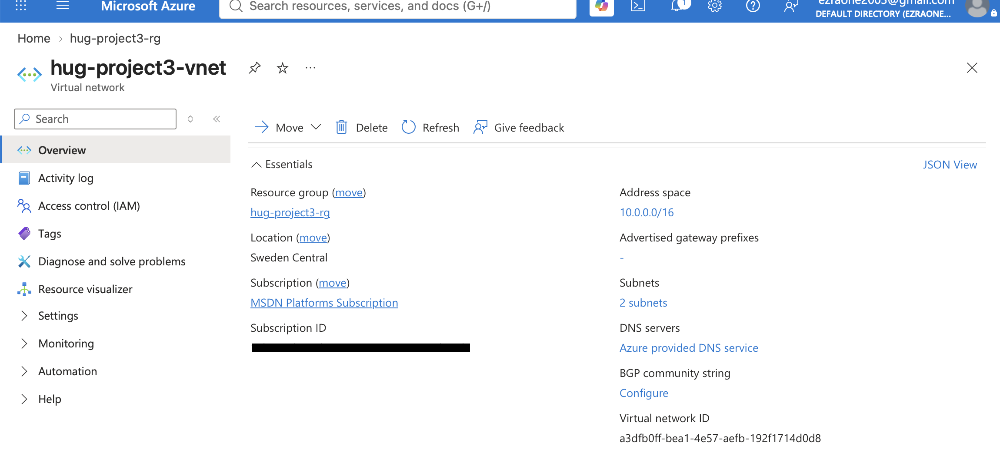
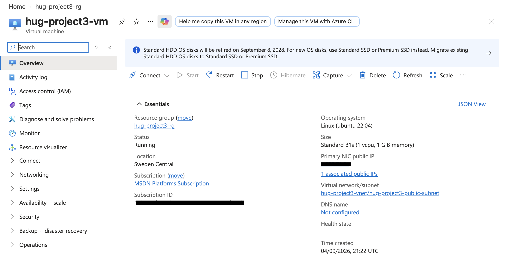
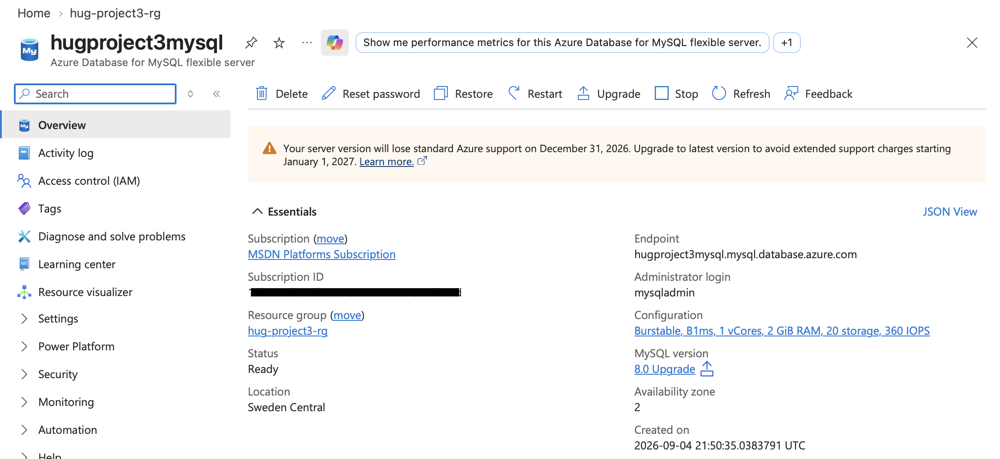
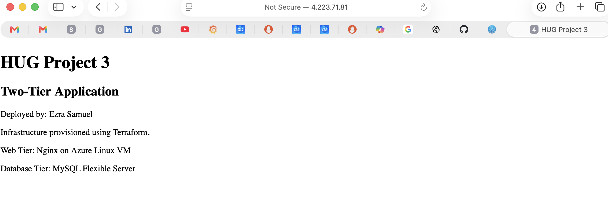

# Deploy a Two-Tier Application on Azure

### Objective
Provision a secure, two-tier environment on Azure using Terraform that follows infrastructure best practices.

---

## Architecture

The project was broken down into five modules: resource_group, network, compute, database, security - each consisting of the main.tf, variables.tf, and outputs.tf files. In addition, the compute module contained a startup script for deploying a simple html page.

```bash
hug-project-3/
│
├── backend.tf
├── provider.tf
├── main.tf
├── variables.tf
├── outputs.tf
├── terraform.tfvars
├── .gitignore
├── README.md
│
└── modules/
    │
    ├── resource_group/
    │   ├── main.tf
    │   ├── variables.tf
    │   └── outputs.tf
    │
    ├── network/
    │   ├── main.tf
    │   ├── variables.tf
    │   └── outputs.tf
    │
    ├── security/
    │   ├── main.tf
    │   ├── variables.tf
    │   └── outputs.tf
    │
    ├── compute/
    │   ├── main.tf
    │   ├── variables.tf
    │   ├── outputs.tf
    │   └── user_data.sh
    │
    └── database/
        ├── main.tf
        ├── variables.tf
        └── outputs.tf
```

---

## Learning Outcomes
- Design and provision secure networking on Azure
- Deploy multiple cloud services with Terraform
- Apply least-privilege security group rules
- Organize Terraform code using modules
- Use variables and outputs effectively
- Store Terraform state remotely

---

## Requirements Implemented

### Networking
- One Virtual Network (VNet)
- One public subnet
- One private subnet
- One Internet Gateway
- One NAT Gateway
- Public and private route tables with associations

### Compute
- One VM in the public subnet running Nginx
- Startup script deploys a simple HTML page

### Database
- MySQL Flexible Server in the private subnet
- Public access disabled
- Storage and instance class configured via variables

### Security Groups
- HTTP/HTTPS (port 80) accessible from the Internet
- SSH (port 22) restricted to my IP
- Database accepts connections only from the compute instance SG
- Database not publicly accessible

---

## Project Structure
- `modules/` → reusable Terraform modules (resource_group, network, compute, database, security)
- `variables.tf` → input variables
- `outputs.tf` → outputs for resource references
- `main.tf` → root configuration
- `backend.tf` → remote state configuration
- `README.md` → project documentation

---

## Deployment Instructions
1. Clone the repository:
   ```bash
   git clone git@github.com:SamuelEzra/Building-Reusable-Infrastructure-with-Terraform-Modules.git
   cd project3
   ```

2. Initialize Terraform:

   ```bash
   terraform init
   ```
3. Validate configuration:

   ```bash
   terraform validate
   ```
4. Apply configuration:

   ```bash
   terraform apply
   ```
5. Destroy resources when done:

   ```bash
   terraform destroy
   ```

## Results

- Virtual Network

   The virtual network is the network boundary for this project. Two subnets were created in this virtual network. One (the public subnet) for the webserver and (the private subnet) for database server.

   

- Running Server

   After successful deployment, the the webserver shows the status as "Running" and outputs the public IP address for connection via a browser.

   

- Database Server

   The database server is also successfully deployed.
   It indicates a ready state.

   

- Webpage

   Upon successful deployment of the webserver, a script automatically runs to create a custom html page. The IP address and the URL are displayed on the terminal and could be accessed with a browser.

   

## Challenges... Lessons...
- As with the other two projects, the project scope was AWS-flavoured and so to achieve the project in Azure, a reconciliation of the terms and Azure-specific requirements was needed. 

- I had subscription restrictions while attempting to use Postgresql Flexible Server. Also, I had restrictions while attempting to provision mySQL Flexible Server in some regions. Hence, the regoin I used for this project is different frm the first two projects in this series.

- I encountered issues with the name I used while attempting to create the Private DNS Zone. Although the private DNS zone must end with ***mysql.database.azure.com***, Azure currently does not support using the server name directly as the private DNS zone in this form.

   So, for a Private DNS Zone, this is NOT acceptable:

   ```bash
   resource "azurerm_private_dns_zone" "dns_zone" {
   name                = "${var.db_name}.mysql.database.azure.com"
   resource_group_name = var.rg
   }
   ```

   But this is:

   ```sh
   resource "azurerm_private_dns_zone" "dns_zone" {
   name                = "${var.db_name}.private.mysql.database.azure.com"
   resource_group_name = var.rg
   }
   ```
   Midpoint, I had to make changes to the name and then did ***terraform apply*** to complete deployment.

- Errors in declaring variables in the individual modules and the root module.entation, I will try to add tags to some resources.